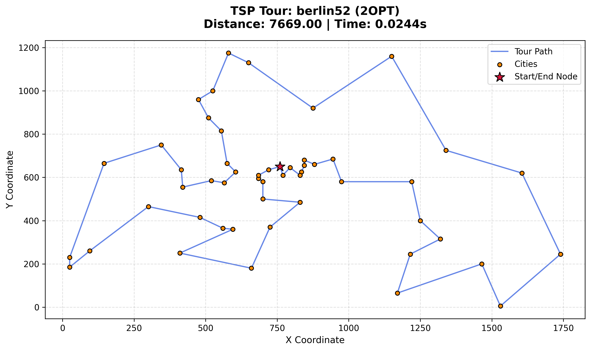

# TSP Solver and Analyzer

This is an academic research project focused on implementing, comparing, and analyzing various heuristic and meta-heuristic algorithms for solving the [Traveling Salesman Problem](https://en.wikipedia.org/wiki/Travelling_salesman_problem) (TSP). The project provides a modular framework for adding new solving algorithms, running automated test batches, and analyzing the results.


## Special Features

*   **Scripted Automation**: A powerful shell script (`solve_tsp.sh`) allows for running batches of tests with different algorithms and datasets.
*   **Command-Line Interface**: A flexible command-line interface in `main.py` provides fine-grained control over the solver execution.
*   **Result Analysis**: The `analyser.py` module processes the raw results to generate insightful summaries and comparisons between algorithms.
*   **Extensibility**: The project is designed to be easily extensible, allowing for the addition of new TSP solvers with minimal effort.
*   **Visualization**: The `visualizer.py` module can generate plots of the TSP tours.

## Folder Structure and Modularization

The project is organized into a modular structure to separate concerns and improve maintainability.

```
tsp-research-project/
├── data/
│   ├── coordinates/      # TSPLIB .tsp files with city coordinates
│   └── distance_matrices/  # For non-TSPLIB format data or custom user data
├── results/                # Output directory for logs, CSV results, and plots
│   ├── figures/
│   ├── plots/
│   └── summaries/
├── src/
│   ├── algorithms/         # Implementations of different TSP solvers
│   │   ├── genetic_algorithm.py
│   │   ├── nearest_neighbour.py
│   │   └── two_opt.py
│   ├── analyser.py         # For analyzing and summarizing results
│   ├── data_parser.py      # For parsing .tsp files
│   └── visualizer.py       # For creating visualizations of TSP solutions
├── main.py                 # Main script to run the TSP solvers
├── requirements.txt        # Python dependencies
└── solve_tsp.sh            # Shell script for automated test runs
```

### Module Descriptions

*   **`main.py`**: The entry point of the application. It handles command-line arguments to run a specific algorithm on a given TSP instance.
*   **`src/`**: This directory contains the core source code of the project.
*   **`src/algorithms/`**: Each file in this directory implements a specific TSP solving algorithm.
*   **`src/data_parser.py`**: Parses the TSPLIB format files from the `data/coordinates` directory.
*   **`src/analyser.py`**: Contains functions to analyze the results from multiple runs, generating summary statistics and comparisons.
*   **`src/visualizer.py`**: Responsible for generating visual representations of the TSP tours.
*   **`data/`**: Contains the TSP datasets. The `coordinates` subdirectory holds a large collection of TSPLIB instances.
*   **`results/`**: All output generated by the scripts is saved here, including detailed logs, CSV files with run data, and plots. This directory is ignored by Git.

## The `solve_tsp.sh` Script

The `solve_tsp.sh` script automates the process of running the TSP solvers on multiple datasets.

You can configure the script by changing the following variables:

*   `ALGORITHMS`: An array of algorithm short names to be tested (e.g., `"ga nn 2opt"`).
*   `NUM_RUNS`: The number of times to repeat each algorithm-dataset combination to gather statistical data.
*   `MIN_CITIES`: The minimum number of cities for datasets to be included in the run.
*   `MAX_CITIES`: The maximum number of cities for datasets to be included in the run.

The script then executes `main.py` with these parameters.

## Features

### Command-Line Arguments

The `main.py` script offers several command-line arguments for configuration:

*   `--dataset`: Specify a single dataset to run (e.g., `berlin52`).
*   `--min-cities`: Minimum number of cities for datasets to be included in the run. Default is 0.
*   `--max-cities`: Maximum number of cities for datasets to be included in the run. Default is 150.
*   `--algorithms`: (Required) List of algorithms to run (e.g., `ga nn 2opt`).
*   `--runs`: Number of runs per algorithm per dataset. Default is 30.
*   `--output-file`: File to append all results to. Default is `results/all_runs.csv`.
*   `--visualize`: Visualize the best tour of the last run for each dataset.

### Algorithm Selection

You can easily select which algorithm(s) to run via the `--algorithms` command-line argument.

For example, this command runs the genetic algorithm (`ga`), nearest neighbour (`nn`), and 2-opt (`2opt`) on the `berlin52` dataset for 5 runs each:
```bash
python main.py --dataset berlin52 --algorithms ga nn 2opt --runs 5
```

### Automated Testing and Analysis

The `solve_tsp.sh` script provides a powerful pipeline for automated testing with the following features:

*   **Auto-Analyzer**: It chains `analysis.py` immediately after `main.py` finishes, passing the correct results file dynamically.
*   **Timestamped Archiving**: Instead of overwriting results, it creates a uniquely timestamped CSV for every run.
*   **Session Logging**: It uses `tee` to capture all terminal output and saves it to a `.txt` log file.
*   **Error Handling**: If `main.py` crashes, the script catches the error and stops before trying to run the analyzer on broken data.
*   **Total Execution Timer**: It calculates and displays how long the entire experiment suite took to complete.

## Visualization

The `visualizer.py` module can generate plots of the solved TSP routes. To use it, add the `--visualize` flag to your command.

For example:
```bash
python main.py --dataset berlin52 --algorithms 2opt --visualize
```



## Datasets

The `data/coordinates` folder contains a wide range of TSP instances from the [TSPLIB](http://comopt.ifi.uni-heidelberg.de/software/TSPLIB95/) library, with up to 2392 cities, currently known best solutions are in the `solutions` file.

## Steps to Reproduce Results

1.  **Clone the repository:**
    ```bash
    git clone <your-repo-url>
    cd tsp-research-project
    ```

2.  **Install dependencies:**
    ```bash
    pip install -r requirements.txt
    ```

3.  **Run a single test:**
    ```bash
    python main.py --algorithms nn --dataset berlin52
    ```

4.  **Run a batch of tests:**
    *   Edit the `solve_tsp.sh` script to configure the algorithms and other variables.
    *   Execute the script:
        ```bash
        bash solve_tsp.sh
        ```

5.  **View the results:**
    *   Check the `results/` directory for logs, CSV files, and plots.
    *   The summary analysis can be found in `results/summaries/`.

## Credits

This project builds upon the work of others in the open-source community.

*   **[TSPLIB](http://comopt.ifi.uni-heidelberg.de/software/TSPLIB95/)**: The datasets used in this project are from the TSPLIB library.
* **[tsplib95](https://github.com/rhgrant10/tsplib95)**: This project uses the tsplib95 library for handling TSPLIB files, developed by [rhgrant10](https://github.com/rhgrant10).
*   **[LaurenceLungo/TSP-Solver](https://github.com/LaurenceLungo/TSP-Solver)**: The visualizer and the idea for the command-line argument functionality were built upon this project (MIT License).
*   **[SonnyFixit/Travelling_salesman_problem](https://github.com/SonnyFixit/Travelling_salesman_problem)**: This repository served as a starting point for the Genetic Algorithm implementation. The code has been altered to support TSPLIB data standards.

For a detailed list of acknowledgments and open-source contributions, please see the [CREDITS.md](CREDITS.md) file.
